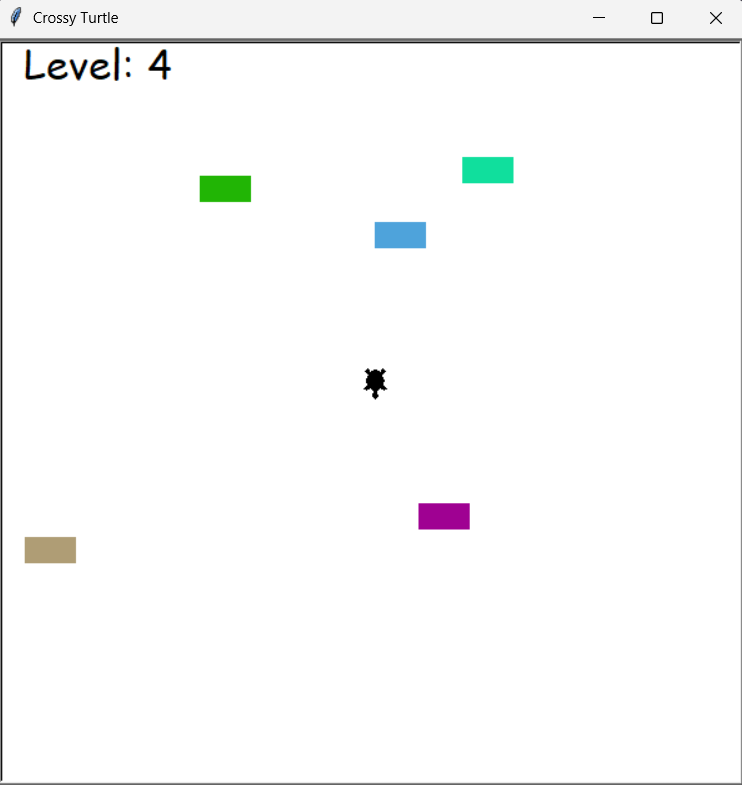

# 🐢 Crossy Turtle

A Crossy Road-inspired game built with Python and the Turtle graphics library.

Help the turtle cross a busy highway while avoiding incoming traffic.

---

## ✨ Features

* **Incremental Difficulty:** The game becomes progressively more challenging as the cars move faster with each completed level.
* **Dynamic Car Spawning:** Cars are generated at random intervals and positions along the highway lanes.
* **Collision Detection:** Detects collisions with incoming cars and ends the game when the turtle is hit.
* **Level Progression:** Displays the current level and increases the game's difficulty after each successful crossing.

---

## 🛠️ Technologies

* **Python 3.x**
* **Object-Oriented Programming (OOP)**
* **Turtle Graphics Library** (Built-in)

---

## 📸 Preview



---

## 🚀 Getting Started

Requirements:

- Python 3.x

No external libraries are required since the project only uses Python's built-in `turtle` module.

1. **Navigate to the Crossy Turtle folder:**
   ```bash
   cd Crossy_Turtle
   ```
2. **Run the Game:**
   ```bash
   python game.py
   ```
---

## 🎮 Usage / Controls

Help the turtle safely navigate through traffic using the keyboard:

* **Arrow Up (⬆️):** Move Forward

---

## 📚 What I Learned

* **Dynamic Object Management:** Generating cars at random positions and efficiently removing them once they leave the screen.
* **Game Loop Timing & Speed Scaling:** Implementing difficulty scaling where the game speed dynamically increments with each successful round.
* **Collision Detection:** Detecting interactions between moving objects while managing safe and hazardous areas within the game.
