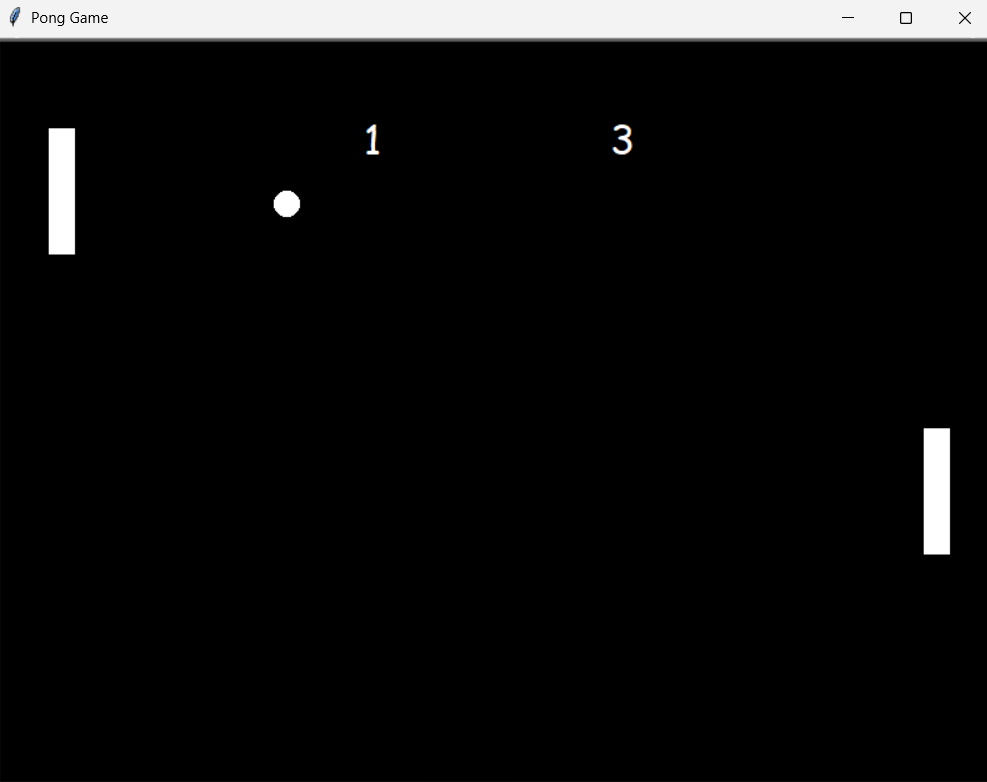

# 🏓 Pong Game

A classic Pong game built with Python and the Turtle graphics library.

---

## ✨ Features

* **Two-Player Gameplay:** Local multiplayer support with independent controls for left and right paddles.
* **Dynamic Physics:** The ball bounces off walls and paddles while gradually increasing its speed after each successful hit.
* **Score System:** Real-time dual scoreboard tracking points for both players.
* **Smooth Animation:** Optimized screen updates for smooth paddle and ball movement.

---

## 🛠️ Technologies

* **Python 3.x**
* **Object-Oriented Programming (OOP)**
* **Turtle Graphics Library** (Built-in)

---

## 📸 Preview



---

## 🚀 Getting Started

Requirements:

- Python 3.x

No external libraries are required since the project only uses Python's built-in `turtle` module.

1. **Navigate to the Pong Game folder:**
   ```bash
   cd Pong_Game
   ```
2. **Run the Game:**
   ```bash
   python game.py
   ```
---

## 🎮 Usage / Controls

| Player | Keys | Action |
|---------|------|--------|
| Left Player | W / S | Move Paddle Up / Down |
| Right Player | ⬆️ / ⬇️ | Move Paddle Up / Down |

---

## 📚 What I Learned

* **Multi-input Event Handling:** Managing simultaneous key presses smoothly to allow independent, responsive movement for both players.
* **Collision Physics & Speed Scaling:** Designing logic to detect paddle collisions, calculate bounce angles, and incrementally increase the ball's speed after each successful hit to scale the difficulty.
* **Game State Management:** Resetting the ball, updating scores, and restarting rounds after each point.

kodlara bakalım sonra atalım bunu da yani
önce hangi dosyadan başlaycağız
