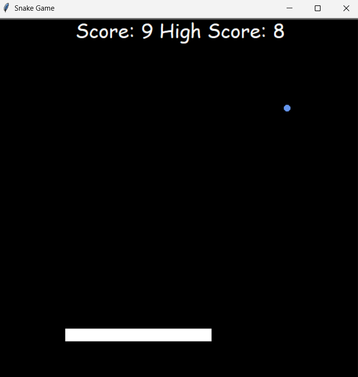

# 🐍 Snake Game
A classic Snake game built with Python and the Turtle graphics library.
---
## ✨ Features
* **Real-time Movement:** Responsive snake control with instant direction changes.
* **Dynamic Growing:** The snake grows longer and the score increases every time it eats food.
* **Collision Detection:** Automatic game-over trigger when hitting the screen boundaries or the snake's own tail.
* **High Score Tracking:** Keeps track of your highest score during the active session.
---
## 🛠️ Technologies
* **Python 3.x**
* **Object-Oriented Programming (OOP)**
* **Turtle Graphics Library** (Built-in)
---
## 📸 Preview

---
## 🚀 Getting Started
Requirements:
- Python 3.x
No external libraries are required since the project only uses Python's built-in `turtle` module.
1. **Navigate to the Snake Game folder:**
   ```bash
   cd Snake_Game
   ```
2. **Run the Game:**
   ```bash
   python game.py
   ```
---
## 🎮 Usage / Controls
Use the arrow keys to control the snake throughout the game.
| Key | Action |
|------|--------|
| ⬆️ | Move Up |
| ⬇️ | Move Down |
| ⬅️ | Move Left |
| ➡️ | Move Right |
---
## 📚 What I Learned
- Designing modular game architecture using object-oriented programming (OOP).
- Managing game state and object interactions in real time.
- Implementing collision detection and movement mechanics.
- Organizing project files into reusable and maintainable components.
